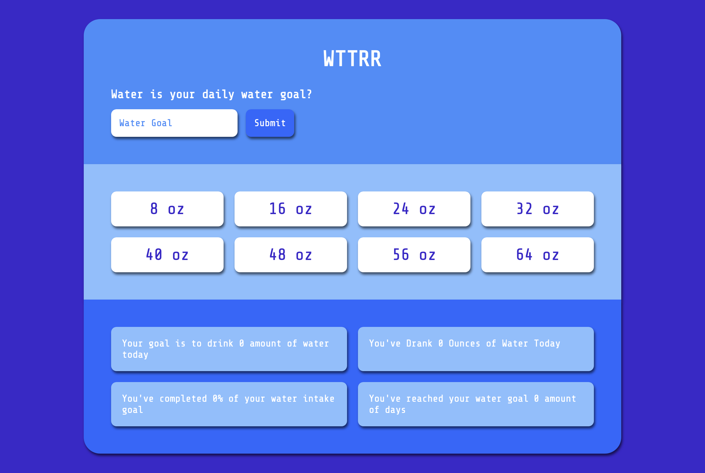

# Water Tracker App

## Table of contents

- [Water Tracker App](#water-tracker-app)
  - [Table of contents](#table-of-contents)
  - [Overview](#overview)
    - [The challenge](#the-challenge)
    - [Screenshot](#screenshot)
    - [Links](#links)
  - [My process](#my-process)
    - [Built with](#built-with)
    - [What I learned](#what-i-learned)
    - [Continued development](#continued-development)
  - [Author](#author)

## Overview

### The challenge

Users should be able to:

- Set a goal for the amount of water they want to drink throughout the day 
- Input the amount of water they drank based on 8oz increments
- Show how far / a percentage away they are from their goal 
- A fun pop up when they hit their goal // TODO
- How many days they've hit their goal 

### Screenshot



### Links

- Solution URL: [Add solution URL here](https://your-solution-url.com)
- Live Site URL: [Add live site URL here](https://your-live-site-url.com)

## My process
1. First I started with what I wanted to tackle with this project 
2. Next, I started crafting out the HTML to make styling easier later on 
3. From there I focused on the functionality of the app, since styling is super easy for me 
   1. I started with the form functionality to input the water intake goal
   2. Then went into the buttons the user can press to add the amount of water they've drank for the day 

### Built with

- Semantic HTML5 markup
- CSS custom properties using SASS as the preprocessor 
- Vanilla JS
- Flexbox
- CSS Grid

### What I learned

- In order to count how many times the user has hit their water intake goal, I had to work with the Date() method. This was interesting to work with so I can gather the date and as long as the date wasn't that day your amount can increase
  ```
    const getDate = () => {
      let date = new Date() 
      date = `${date.getMonth() + 1}/${date.getDate()}/${date.getFullYear()}`
      return date 
    }
  ```
  ```
    if (percOfGoal >= 100) {
      const lastTimeWaterGoalCompleted = getDate() 

      if (timesWaterGoalCompleted === 0) {
        timesWaterGoalCompleted++ 
        timesWaterGoalCompletedText.innerHTML = `You've reached your water goal ${timesWaterGoalCompleted} amount of days`
      } else if (lastTimeWaterGoalCompleted !== getDate()) {
        timesWaterGoalCompleted++ 
        timesWaterGoalCompletedText.innerHTML = `You've reached your water goal ${timesWaterGoalCompleted} amount of days`
      }
    }
  ```
- It has been awhile since I've coded something with vanilla JS and not used a framework like React or Gatsby, so it was interesting to go back to the fundamentals of it all and build something from scratch

### Continued development
- Next I want to implement a pop up for the user to be able to see when they've hit their water intake goal 
- I would also like to implement to progress bar so the user can see a visual for their progress 

## Author

- Website - [Add your name here](https://lindseydortch.github.io/codewithlinds-portfolio/)
- Twitter - [@yourusername](https://www.twitter.com/codewithlinds)
